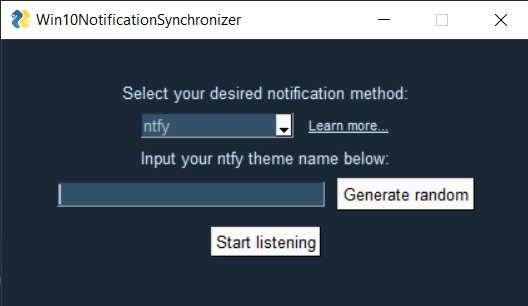
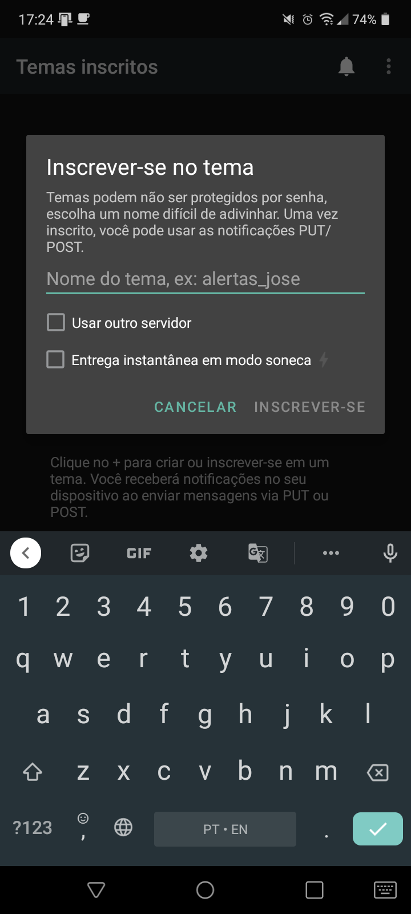
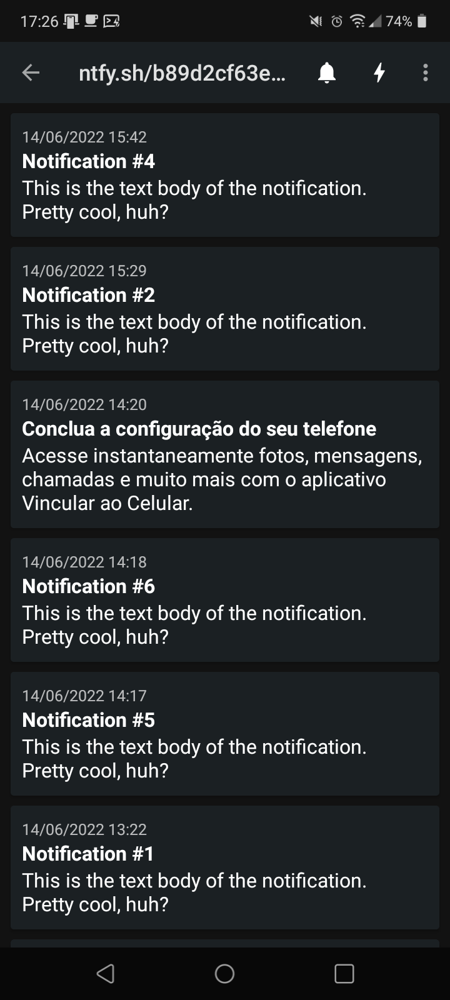
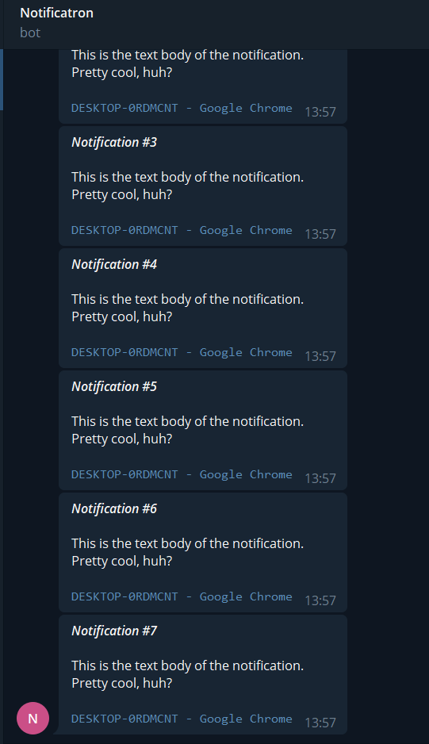

# DTAN - DesktopToAndroidNotifications

Simple python application that sends your Windows 10 or Linux (DBus) toast notifications to your phone.

Supported channels:
- [ntfy.sh](https://ntfy.sh)
- Telegram (in progress)

---

### How to run the application

Requirements: Python > v3.6 and pip (and pipenv too if you'd like to separate things).

Install dependencies
````commandline
pip install -r requirements.txt
````

Run with python (or just run the .exe from the releases page)
````commandline
python notif.py
````

---
### How to - ntfy

1. Run the application, you should see a screen like below:

2. Generate a new ntfy room code by clicking the "Generate random" button.
3. Start listening.
4. Switch over to your Android phone.
5. Install the app ntfy from the PlayStore.
6. You should see something like this:

7. Click the "+" sign.

8. Here, insert the code that was generated by the application (be sure to check the second checkbox if you want notifications while the phone is sleeping).

9.Finally, confirm the prompt and you should have a list of notifications like this that will be updated whenever your Win10 gets a toast notification:

---

### How to - Telegram

You will have to create a new Telegram bot and find out your chat id. You can follow any tutorial on the internet, just be sure to have your bot's API key and your chat id before starting.

1. Run the application.
2. Select the Telegram mode in the dropdown.
3. Enter your api key in the leftmost input and your desired chat id in the rightmost input.
4. Start listening.
5. Now you should receive your windows notifications in your chat, sent by your bot.



---
### How to - commandline

You can launch the application by the commandline.

First, run the app an initial time using the commands below, there will be a configuration file generated for the app (cfg.ini).
Then, fill in the required parameters and run the app one more time using the desired method.

Launch using ntfy:
````commandline
python notif.py ntfy
````

Launch using Telegram notifications:
````commandline
python notif.py telegram
````